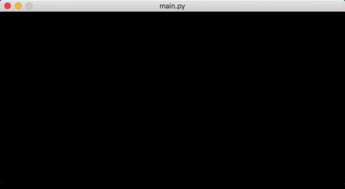

# Chip-8

A Chip-8 Emulator in Python 



Chip-8 is an interpreted programming language, developed by Joseph Weisbecker.
It was initially used on some computer systems in the late 1970s.
The COSMAC VIP, DREAM 6800, and ETI 660 computers are a few examples.
These computers typically were designed to use a television as a display, had between 1 and 4K of RAM, and used a 16-key hexadecimal keypad for input.
There are a number of classic video games ported to Chip-8, such as Pong, Space Invaders, Tetris, and Pac-Man.

In the early 1990s, the Chip-8 language was revived by a man named Andreas Gustafsson.
He created a Chip-8 interpreter for the HP48 graphing calculator, called Chip-48.
The HP48 was lacking a way to easily make fast games at the time, and Chip-8 was the answer.
Chip-48 later begat Super Chip-48, a modification of Chip-48 which allowed higher resolution graphics, as well as other graphical enhancements.

Chip-48 inspired a whole new crop of Chip-8 interpreters for various platforms, including MS-DOS, Windows 3.1, Amiga, HP48, MSX, Adam, and ColecoVision.

## Installing

1. Install `pip` and `git`.
2. Clone (or download) the Chip-8 emulator:
```
git clone https://github.com/tommasomarroni/Chip-8.git
```
3. Install the required dependencies:
```
pip install -r requirements.txt
```

## Running

Run with:
```
python main.py <chip-8 ROM>
```
where <chip-8 ROM> is the full path to the Chip-8 ROM.

Example:
```
python main.py games/brix
```

## References

- [Cowgod's Chip-8 - Technical Reference v1.0](http://devernay.free.fr/hacks/chip8/C8TECH10.HTM)
- [CHIP-8 - Wikipedia](https://en.wikipedia.org/wiki/CHIP-8)
